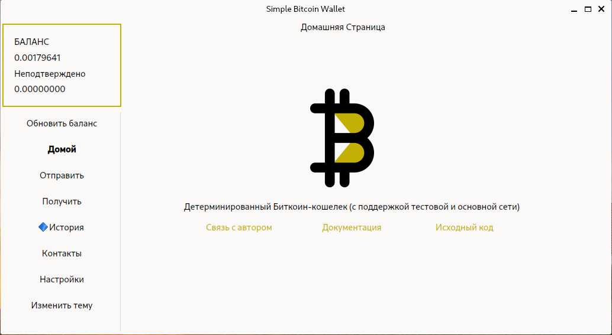

# Simple Bitcoin Wallet


**Некастодиальный детерминированный Bitcoin кошелек**


## Установка
Для Unix-подобных ОС:

```
git clone https://github.com/gberdyshev/simple-bitcoin-wallet.git
cd simple-bitcoin-wallet
python3 -m venv venv
source venv/bin/activate
python3 -m pip install -r req.txt
python3 -m simple_bitcoin_wallet
```
[Подробнее](./docs/user_guide.md)

## Зависимости
- pyqt6
- pyside6
- cryptos-witness (форк библиотеки cryptos с исправленным багом)
- requests
- sqlcipher3
- qrcode

## Реализовано
- Поддержка мнемонических слов и детерминированных кошельков
- Поддержка генерации любого числа адресов (для детерминированных кошельков)
- Хранение истории транзакций, подробная информация по необходимым транзакциям
- Хранение всех ранее сгенерированных адресов
- Шифрование файла кошелька (для unix-подобных ОС), возможность его хранения на сторонних носителях
- Кроссплатформенность решения
- Расчет актуальной комиссии (сторонний API)

## Планы
- Реализация Watch-only режима (только просмотр) в виде браузерного расширения 
- Сборка ``sqlcipher3`` под Windows для полноценной поддержки этой ОС
- Сборка и публикация пакета в PyPi


 

## Замечание
В рамках этого проекта мною был исправлен баг некорректного отображения некоторых адресов в библиотеке cryptos, был создан PR, который на сегодняшний день не принят,
поэтому было принято решение опубликовать форк библиотеки на PyPI (https://pypi.org/project/cryptos-witness/)


