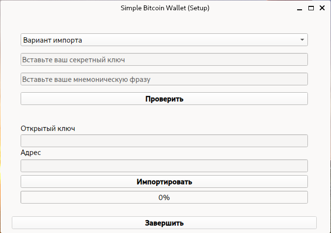
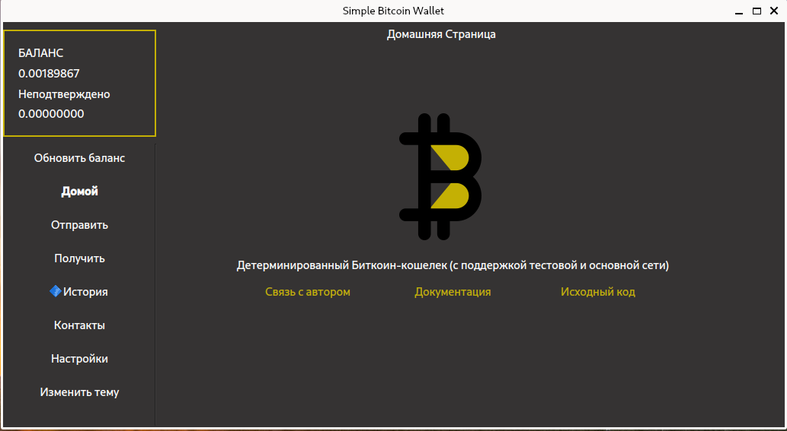
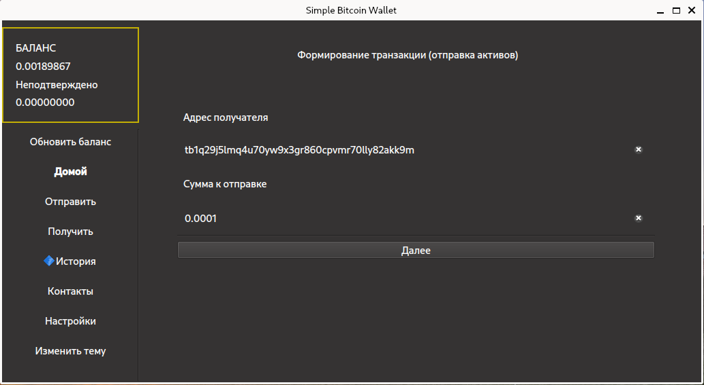
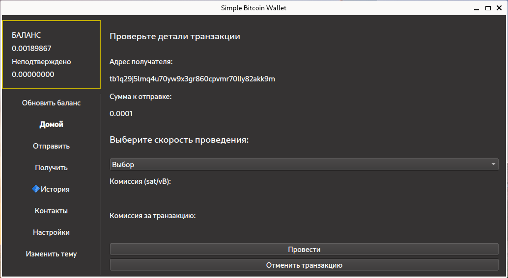
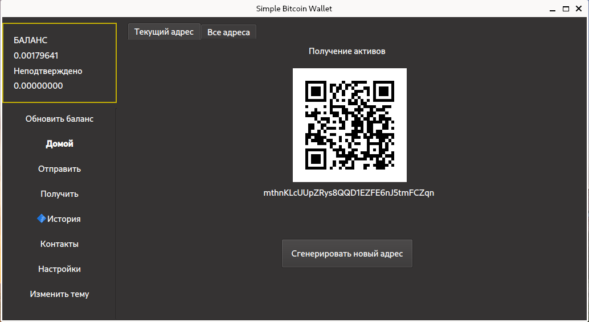
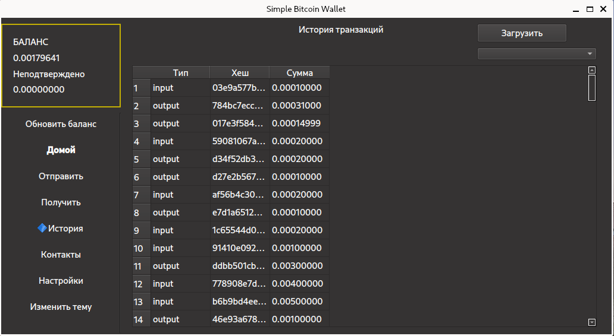
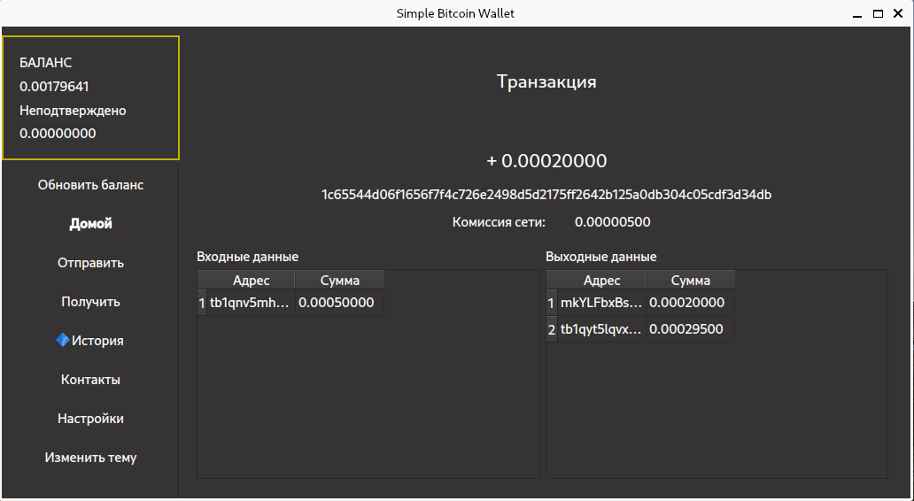

# Руководство пользователя
Рекомендуется использовать приложение на unix-подобных ОС, так как это значительно повышает безопасность ваших активов и позволяет использовать все функции приложения (особенно, шифрование файла с секретными ключами)

Приложение на данный момент (по умолчанию) работает в тестовой сети, вы можете изменить этот параметр. Для этого в файле "config.json" измените параметр "network" на "mainnet" (требуется пересоздание кошелька, но вы можете использовать существующую сид-фразу).

## Навигация
**[Установка](#установка)**
- [Unix-подобные ОС](#unix-подобные-ос-linux-macos-bsd)
- [Windows](#windows)

**[Первоначальная настройка](#первоначальная-настройка-инициализация)**
- [Создание кошелька](#создание-кошелька-с-нуля)
- [Импорт кошелька](#импорт-кошелька)
- [Сохранение и восстановление файлов](#сохранение-файлов-с-данными-кошельков)

**[Использование](#использование)**
- [Баланс](#просмотр-баланса)
- [Отправка транзакций](#создание-транзакции-отправка-активов)
- [Получение активов](#получение-активов)
- [Просмотр истории транзакций](#история-транзакций)


## Установка

### Unix-подобные ОС (Linux, MacOs, *BSD)
1. Получить репозиторий
```
git clone https://github.com/gberdyshev/simple-bitcoin-wallet.git
cd simple-bitcoin-wallet
```

2. Установить зависимости из файла ``req.txt``. Рекомендуется это делать в виртуальном окружении Python ([подробнее про venv](https://docs.python.org/3/library/venv.html)).

```
python3 -m venv venv
source venv/bin/activate
python3 -m pip install -r req.txt
```
3. Запустить приложение
```
python3 -m simple_bitcoin_wallet
```
### Windows

В процессе...


## Первоначальная настройка (инициализация)
Использование приложения начинается с первоначальной настройки, которая предлагает импортировать имеющийся кошелек или создать новый.
### Создание кошелька с нуля
Если у вас нет мнемонической фразы или секретного ключа, то вы можете создать кошелек с нуля, но он будет создан на основе сида, т.е. будет являться детерминированным, и основным идентификатором для него станет мнемоническая фраза из 12 слов, которую нужно будет надежно сохранить. 

Для этого: "Создание кошелька", далее в появившемся окне нажать на кнопку "Генерировать" (рекомендуется сделать несколько нажатий), затем "Показать секретный ключ".


Далее необходимо записать и надежно **сохранить мнемоническую фразу** (самое первое поле), секретный ключ сохранять не обязательно, так как все эти ключи могут быть восстановлены из мнемонической фразы.

В следующем окне задайте пароль кошелька и перейдите к использованию.

Приложение готово к работе!

### Импорт кошелька
Если у вас есть мнемоническая (сид) фраза или секретный ключ и вы знаете, что это такое, вы можете сразу импортировать их в кошелек.

Для этого: "Импорт кошелька", далее в появившемся окне выберите необходимый вариант импорта (секретный ключ или мнемоническая фраза) и вставьте в соответствующее поле ключ или фразу.



После этого нажмите на кнопку "Проверить" и убедитесь, что открытый ключ и адрес соответствуют тем, что у вас были. !Если вы импортируете сид-фразу, то будет выведена только первая пара ключей (с индексом 0)!

Нажмите на кнопку "Импортировать", дождитесь окончания поиска и кэширования транзакций в базу данных и нажмите "Завершить".

В следующем окне задайте пароль кошелька и перейдите к использованию.

Приложение готово к работе!

### Сохранение файлов с данными кошельков

Приложение по умолчанию сохраняет данные (data.db) и файл с ключами (wallet.db, зашифрован) в директории "db". Вы можете сделать резервную копию этих файлов и при следующей установке либо расположить их в директории по умолчанию, либо прописать место их нахождения в "config.json".

## Использование
**Предупреждение!**

```Программа не сохраняет ваши ключи нигде, кроме локальной базы данных (зашифрованной паролем), поэтому за сохранность резервных копий ваших ключей несете ответственность только вы.```

Перед использованием приложения требуется пройти авторизацию (ввести пароль), без этого расшифровка файла с базой данных невозможна, а следовательно невозможно и нормальное функционирование приложения.


В приложении рекомендуется использовать темную тему (т.к. цветовая палитра подбиралась под нее), но доступна и светлая. Сменить тему можно, нажав на кнопку "Изменить тему" в главном меню.

### Просмотр баланса
После авторизации (ввода пароля) приложение автоматически начнет подгружать сведения о балансе (это может занять некоторое время), для их обновления следует использовать кнопку "Обновить баланс".

### Создание транзакции (отправка активов)

Для создания транзакции: "Отправить" в главном меню. Далее введите адрес получателя и сумму отправки.



После нажатия на кнопку "Далее" приложение произведет предварительный расчет и попросит вас проверить данные транзакции


Затем выберите скорость проведения транзакции (в тестовой сети проводятся транзакции с минимальной комиссией, поэтому в ней с большой вероятностью при выборе любого значения вы увидите комиссию 1 sat/vbyte - 1 сатоши за байт, но в основной сети эти значения будут значительно отличаться).

После выбора комиссии: "Провести", введите пароль от кошелька. Если все успешно, то вы увидите соответствующее сообщение и гиперссылку на проводник блокчейна (транзакция может отобразится там не сразу, а через 5-10 секунд, [пример транзакции](https://mempool.space/testnet/tx/18e1a98667697e74844634e9a81548108d2d7d4b2586c158815870bd9a527f9b)). 

Теперь можно обновить баланс и увидеть отрицательное значение в графе "Неподтверждено", это значит что ваша транзакция еще не подтверждена майнерами и находится в пуле неподтвержденных транзакций, как только ее подтвердят (проведут), из вашего основного баланса будет вычтена отправленная сумма и комиссия.

### Получение активов

Для получения адресов кошелька: "Получить" в главном меню. 



Вам будет предоставлен последний сгенерированный адрес, если вы используете детерминированный кошелек, то можете сгенерировать любое количество адресов: "Сгенерировать новый адрес", новый адрес вместе с QR-кодом отобразится у вас на экране (скопировать его в буфер обмена можно путем клика на адрес). 

Все ранее сгенерированные адреса доступны на вкладке "Все адреса". Аналогично возможно скопировать любой адрес в буфер обмена путем двойного клика на строку списка с необходимым адресом.

### История транзакций

Для получения истории транзакций "История" в главном меню.


История транзакций будет подгружена из базы данных, чтобы подгрузить новые данные необходимо нажать на кнопку "Загрузить" и дождаться обновления (программа не зависает, можно переходить в другие разделы и использовать другие функции)

Чтобы получить более подробную информацию о транзакции, необходимо кликнуть на строку с ней в таблице.



Руководство предназначено для пользователей. 

[Документация для разработчиков](./developer_guide.md)